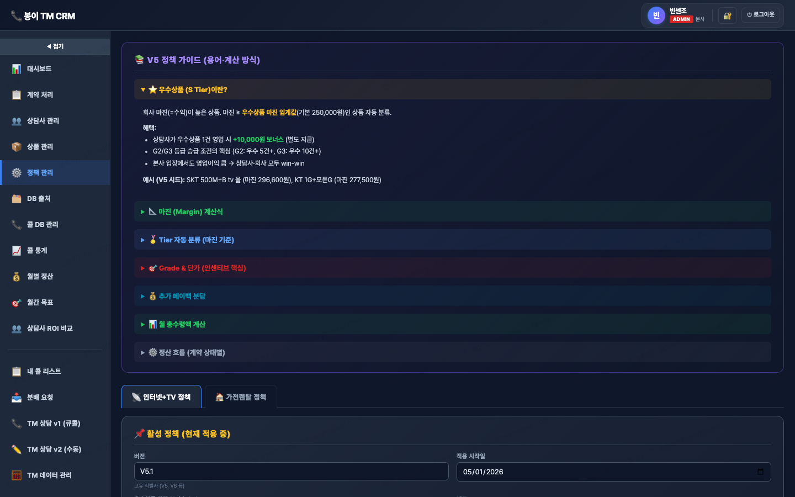

# ⚙️ 정책 관리

> `menu-key`: **`rules`** · iframe: **`/docs/incentive-rules.html`**

> 라이브 캡쳐: `screens/05-rules.png`


## 1. 접근 권한
| admin | manager | agent | contract |
|---|---|---|---|
| ✓ | · | · | · |

## 2. 화면


## 3. 소스 파일
- `docs/incentive-rules.html` · 1927 lines · `<title>인센티브 정책 관리 (admin)</title>`

## 4. 사용 API endpoint
| endpoint | 매칭된 서버 라우트 |
|---|---|
| `/api/incentive/rules` | GET incentive.js:/rules, POST incentive.js:/rules |
| `/api/rental/policy` | GET rental.js:/policy, PATCH rental.js:/policy |
| `/api/rental/recalculate-margins` | POST rental.js:/recalculate-margins |
| `/api/rental/recalculate-paybacks` | POST rental.js:/recalculate-paybacks |

## 5. DB 테이블 (추정)
- `incentive_it`
- `incentive_rt`
- `incentive_rules`

## 6. localStorage / sessionStorage key
- `incentive-auth-token-v1`
- `policy-active-tab-v1`

## 7. 핵심 function (상위 15개)
```js
F
activate
careRate
clearToken
collectForm
f
factorPct
fetchAgent
fetchAllRules
getToken
init
loadActiveToForm
loadAll
loadRP
login
```

## 8. 알려진 함정 / 주의
- `listCols` 4곳 동기화 (memory: `feedback_listcols_pitfall.md`)
- 빈 값 PATCH 함정 (`val !== ''` 체크)
- snapshot 박제: 가격·정책 변경 시 기존 row 보존
- Cloudflare 24h 캐시 → 변경 시 `?v=N` cache-buster

## 9. 개발자 체크리스트 (이 메뉴 수정 시)
- [ ] HTML input `data-field` 추가
- [ ] 서버 destructure에 컬럼 추가
- [ ] update 할당에 컬럼 추가
- [ ] `listCols` SELECT에 컬럼 추가 (가장 자주 누락)
- [ ] 데브 검증 후 라이브 머지
- [ ] SW_VERSION 증가 + `?v=YYYYMMDD`
