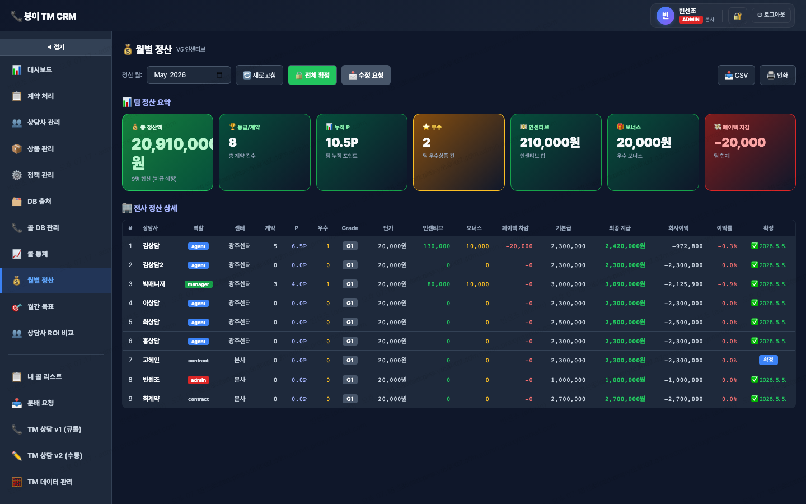

# 💰 월별 정산

> `menu-key`: **`settlements`** · iframe: **`/docs/incentive-settlements.html`**

> 라이브 캡쳐: `screens/09-settlements.png`


## 1. 접근 권한
| admin | manager | agent | contract |
|---|---|---|---|
| ✓ | ✓ | ✓ | · |

## 2. 화면


## 3. 소스 파일
- `docs/incentive-settlements.html` · 509 lines · `<title>월별 정산</title>`

## 4. 사용 API endpoint
_API 호출 미검출 (정적 HTML이거나 외부 lib 사용)_

## 5. DB 테이블 (추정)
- `incentive_sum`

## 6. localStorage / sessionStorage key
- `incentive-auth-token-v1`

## 7. 핵심 function (상위 15개)
```js
TK
checkPendingCorrections
closeCorrections
esc
exportCSV
fetchAuth
finalizeAll
finalizeOne
fmt
loadAll
loadCorrections
loadManagerOverride
openCorrections
rejectCor
renderKpi
```

## 8. 알려진 함정 / 주의
- `listCols` 4곳 동기화 (memory: `feedback_listcols_pitfall.md`)
- 빈 값 PATCH 함정 (`val !== ''` 체크)
- snapshot 박제: 가격·정책 변경 시 기존 row 보존
- Cloudflare 24h 캐시 → 변경 시 `?v=N` cache-buster

## 9. 개발자 체크리스트 (이 메뉴 수정 시)
- [ ] HTML input `data-field` 추가
- [ ] 서버 destructure에 컬럼 추가
- [ ] update 할당에 컬럼 추가
- [ ] `listCols` SELECT에 컬럼 추가 (가장 자주 누락)
- [ ] 데브 검증 후 라이브 머지
- [ ] SW_VERSION 증가 + `?v=YYYYMMDD`
