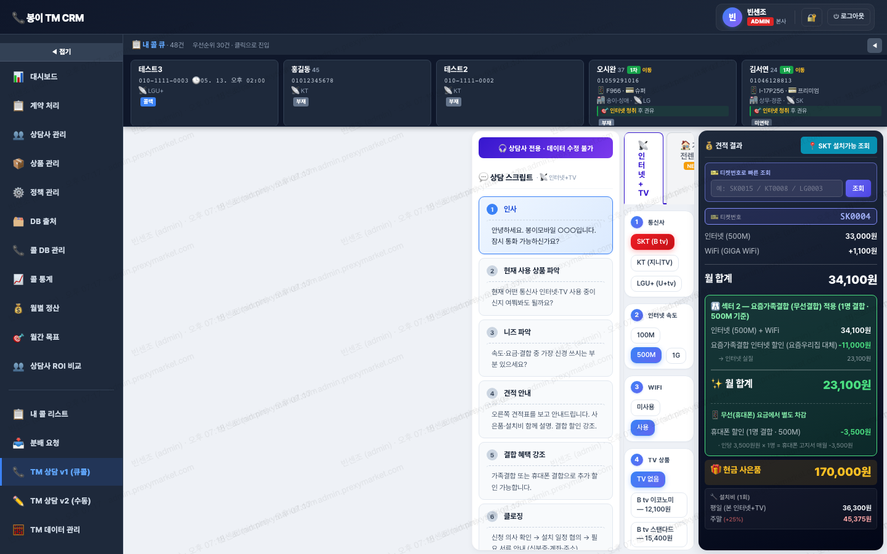

# 📞 TM 상담 v1 (큐콜)

> `menu-key`: **`tm-counselor`** · iframe: **`/docs/tm-counselor.html`**

> 라이브 캡쳐: `screens/14-tm-counselor.png`


## 1. 접근 권한
| admin | manager | agent | contract |
|---|---|---|---|
| ✓ | ✓ | ✓ | ✓ |

## 2. 화면


## 3. 소스 파일
- `docs/tm-counselor.html` · 6254 lines · `<title>TM 상담 도구 (상담사 전용)</title>`

## 4. 사용 API endpoint
| endpoint | 매칭된 서버 라우트 |
|---|---|
| `/api/auth/login` | POST auth.js:/login |
| `/api/customer-db` | GET customer-db.js:/ |
| `/api/customer-db/` | GET customer-db.js:/ |
| `/api/incentive/agents/me` | GET incentive.js:/agents/me |
| `/api/incentive/products` | GET incentive.js:/products |
| `/api/incentive/sales/` | (매칭 안됨 — 다른 파일 또는 동적 path) |
| `/api/incentive/tm/memos` | GET incentive.js:/tm/memos, PUT incentive.js:/tm/memos |
| `/api/incentive/tm/scripts` | GET incentive.js:/tm/scripts, PUT incentive.js:/tm/scripts |

## 5. DB 테이블 (추정)
- `incentive_agent`
- `incentive_products`
- `incentive_sales`

## 6. localStorage / sessionStorage key
- `cq-side-collapsed`
- `incentive-auth-token-v1`
- `rental-incentive-state-v1`
- `tm-scripts-rental-v1`

## 7. 핵심 function (상위 15개)
```js
INC_API
_isManualMode
_renderQuoteImpl
_saleIdReQuote
add
address
addressDetail
agent
all
applyAllSeedToD_TM
applyGiftOverrides
authClearToken
authFetchIncentiveAgent
authGetToken
authGetUser
```

## 8. 알려진 함정 / 주의
- `listCols` 4곳 동기화 (memory: `feedback_listcols_pitfall.md`)
- 빈 값 PATCH 함정 (`val !== ''` 체크)
- snapshot 박제: 가격·정책 변경 시 기존 row 보존
- Cloudflare 24h 캐시 → 변경 시 `?v=N` cache-buster

## 9. 개발자 체크리스트 (이 메뉴 수정 시)
- [ ] HTML input `data-field` 추가
- [ ] 서버 destructure에 컬럼 추가
- [ ] update 할당에 컬럼 추가
- [ ] `listCols` SELECT에 컬럼 추가 (가장 자주 누락)
- [ ] 데브 검증 후 라이브 머지
- [ ] SW_VERSION 증가 + `?v=YYYYMMDD`
