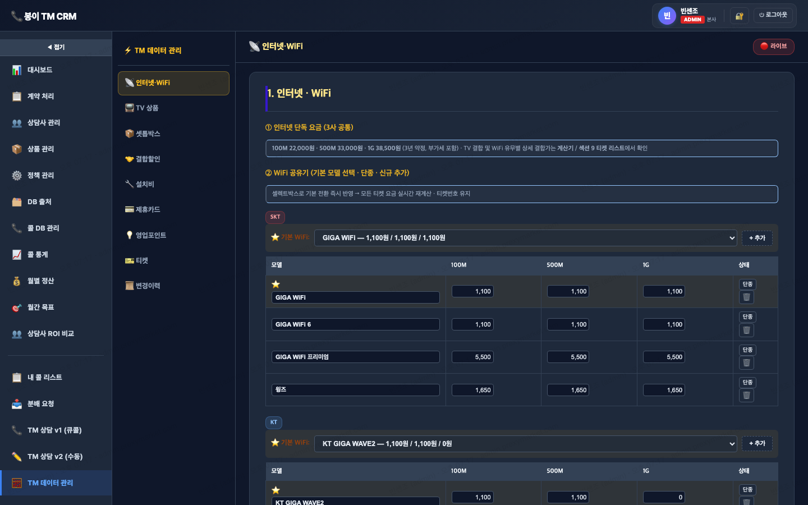

# 🧮 TM 데이터 관리

> `menu-key`: **`tm-data`** · iframe: **`/docs/calculator.html?admin=1`**

> 라이브 캡쳐: `screens/16-tm-data.png`


## 1. 접근 권한
| admin | manager | agent | contract |
|---|---|---|---|
| ✓ | ✓ | · | · |

## 2. 화면


좌측 서브메뉴 9개 — **인터넷·WiFi** / TV 상품 / 셋톱박스 / 결합할인 / 설치비 / 제휴카드 / 영업포인트 / **티켓** / 변경이력

## 3. 소스 파일
- `docs/calculator.html` · 4,138 lines · `<title>봉이모바일 — 인터넷+TV 상품 구성 + 요금 계산기</title>`

## 4. 사용 API endpoint
| endpoint | 매칭된 서버 라우트 |
|---|---|
| `/api/incentive/calc-history` | POST `incentive.js:/calc-history`, GET `incentive.js:/calc-history` |
| `/api/incentive/products` | GET `incentive.js:/products` |

> ⚠️ **티켓 데이터는 fetch 없이 JS로 동적 생성** — `generateTickets()` (line 1334) → localStorage 시드 기반 105개 메모리 계산.

## 5. DB 테이블
- `incentive_calculator_history` — calc-history 저장
- `incentive_products` — 상품 카탈로그 (active_only=true)
- `incentive_calculator_overrides` — admin 수정 데이터 영구 저장 (시드)
- `bongi_tickets` (간접) — 티켓 카탈로그 (좌측 "티켓" 서브메뉴 — 아래 §10 참조)

## 6. localStorage / sessionStorage key
- 공통 `incentive-auth-token-v1`
- `D` 객체 — 통신사별 시드 (속도/TV/WiFi/셋톱/할인 등)
- `SALES_DEFAULT` — 영업포인트 기본값
- `_calc-data-sync.js` 통해 자동 sync

## 7. 핵심 function (상위 15개)
```js
_adminActivate
_calcHistoryFromDb
addCustomCatalogRow
addInstallColumn
addKtFixedRange
addKtPremRow
addKtTotalRange
addPartnerCard
addRule
addSalesRow
addSetTop
addTVRow
addWifi
applyAllSeedToD
applyBundleOverrides
generateTickets       ← 105개 티켓 동적 생성
renderTicketList      ← #ticket-list-container 렌더링
```

## 8. 알려진 함정 / 주의
- `listCols` 4곳 동기화 (memory: `feedback_listcols_pitfall.md`)
- 빈 값 PATCH 함정 (`val !== ''` 체크)
- snapshot 박제: 가격·정책 변경 시 기존 row 보존
- Cloudflare 24h 캐시 → 변경 시 `?v=N` cache-buster
- ⚠️ **티켓 시스템 이중화** — 운영 105개(JS) vs DB 1,053건(별도). 아래 §10 참조.

## 9. 개발자 체크리스트 (이 메뉴 수정 시)
- [ ] HTML input `data-field` 추가
- [ ] 서버 destructure에 컬럼 추가
- [ ] update 할당에 컬럼 추가
- [ ] `listCols` SELECT에 컬럼 추가 (가장 자주 누락)
- [ ] 데브 검증 후 라이브 머지
- [ ] SW_VERSION 증가 + `?v=YYYYMMDD`

---

## 10. 티켓 관리 시스템 (좌측 서브메뉴 "티켓")

### 10.1 운영 진실 — **105개** (3사 합산)
`calculator.html` line 1321~1366 `generateTickets()` JS가 동적 생성:

| 통신사 | 갯수 | 범위 |
|---|---|---|
| SK | 60 | SK0001 ~ SK0060 |
| KT | 30 | KT0001 ~ KT0030 |
| LG | 15 | LG0001 ~ LG0015 |
| **합계** | **105** | (internet 결합) |

추가 **렌탈 티켓 51개** (R001~R051) — `bongi_rental_products`와 연동.

### 10.2 정책 (calculator.html line 858~862)
- 티켓번호 = **속도 × TV × WiFi 유/무**로 결정 (셋톱 독립)
- WiFi 요금=0원인 경우(KT 1G / LGU+ 전 속도)는 유/무 구분 없이 1개 티켓
- 셋톱·WiFi 모델 추가·단종 → 기본값 교체 → **티켓번호 영향 없음** (요금만 재계산)
- **티켓번호는 영구 발급** (재사용 X, 비활성만 존재) — snapshot 박제 정책

### 10.3 렌더링 (line 2691~2712)
```js
function renderTicketList() {
  var carriers = window.__CARRIER_FILTER__ ? [window.__CARRIER_FILTER__] : ['skt', 'kt', 'lgu'];
  // 통신사별로 carrierTickets = TICKETS.filter(...) → 테이블 행
  ...
  document.getElementById('ticket-list-container').innerHTML = html;
}
```

### 10.4 `bongi_tickets` 테이블 — **별개 시스템 (봉이 메인 사이트용)**

⚠️ **이 메뉴(어드민 견적)와 무관**. 봉이 고객 사이트(`bongi-mobile.com`)의 신청 카탈로그.

| 상태 | internet | rental | 합계 |
|---|---|---|---|
| `is_active=true` | 1,002 | 50 | 1,052 |
| `is_active=false` | 0 | 1 | 1 |
| **total rows** | 1,002 | 51 | **1,053** |

**실제 사용 증거**: `bongi_applications.product_ticket`에 SK0188 / KT0311 / LG0079 / SK0398 / KT0146 (105 범위 밖) 사용 중.

### 10.5 두 티켓 시스템 비교

| 항목 | 어드민 견적 (이 메뉴) | 고객 사이트 (bongi_tickets) |
|---|---|---|
| 갯수 | 105 internet | 1,002 internet + 50 rental |
| 데이터 source | JS 메모리 (`calculator.html`) | DB 테이블 |
| 시드 변경 시점 | `incentive_calculator_overrides` 즉시 | manual / sync |
| 사용처 | TM 상담 견적 화면 | 봉이 메인 고객 신청 흐름 |
| ticket_number 범위 | SK0001~60 / KT0001~30 / LG0001~15 | SK0001~450 / KT0001~360 / LG0001~192 |
| 영업 연결 | `incentive_sales` (ticket_number 컬럼 없음) | `bongi_applications.product_ticket` |

**둘은 데이터 동기화 안 됨**. 같은 `SK0001`이라도 다른 의미일 수 있음.

### 10.6 와이어프레임 (`/admin/`) 발견
- `<title>봉이모바일 어드민 와이어프레임</title>`
- 9,594 lines 단일 HTML, light theme
- **인증 없이 누구나 접근 가능** (보안 검토 필요)
- `/api/admin/platform/tickets` 호출 → `bongi_tickets` 표시
- 즉 와이어프레임은 **고객 사이트 데이터의 관리 UI prototype**

### 10.6 carrier 표기 분기 ⚠️
| 시스템 | 표기 |
|---|---|
| `bongi_tickets.carrier` | SKT / KT / LGU+ |
| `incentive_products.carrier` | SK / KT / LG |
| Client (calculator.html JS) | skt / kt / lgu |
| ticket_number prefix | SK / KT / LG |

매핑 헬퍼 사용 필수 — memory `[[project_bongi_carrier_mapping]]`

### 10.7 관련 API
| Method | Path | 인증 | 비고 |
|---|---|---|---|
| GET | `/api/admin/platform/tickets` | (없음) | `?carrier=SK&search=KT0001` |
| GET | `/api/admin/platform/ticket/:ticket` | (없음) | 단건 |
| POST | `/api/admin/platform/tickets/sync` | (없음) | 렌탈 sync + 비활성 연쇄 |

> prefix 주의: 파일 `admin-platform.js`, 마운트는 `/api/admin/platform` (server/index.js line 171)
